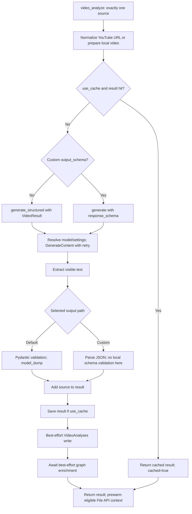
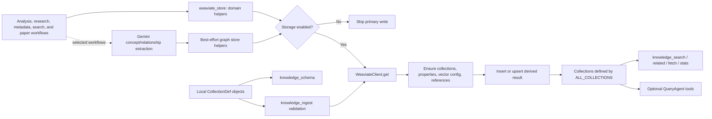
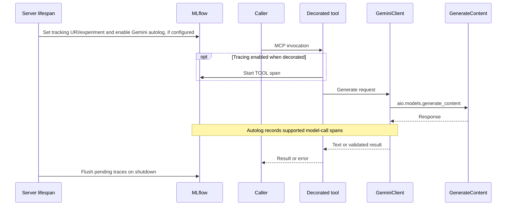
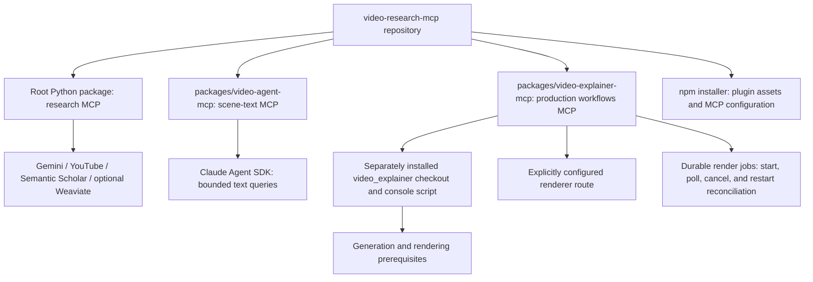
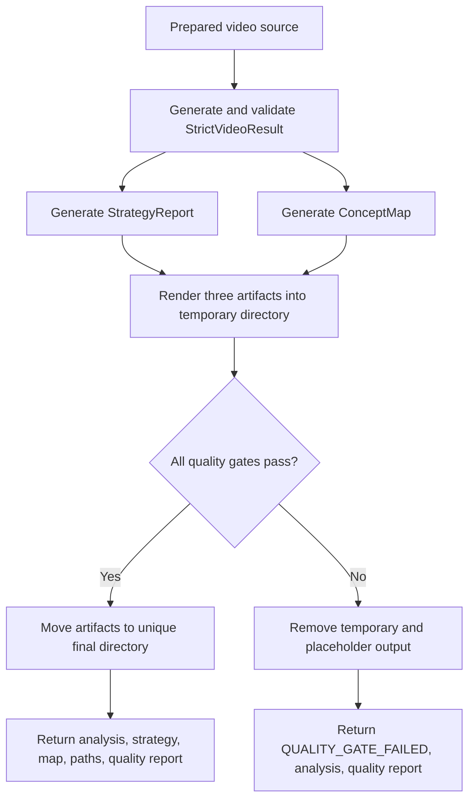

# Architecture Diagrams

These diagrams show which component owns each step. Read the
[architecture guide](ARCHITECTURE.md) for contracts and limitations, and the
[tool manifest](metrics/tool-contract-manifest.json) for its dated parameter
snapshot. Current app discovery or a fresh export gives the current schemas.
Arrows describe the current source flows; they do not establish live provider
availability or successful installation.

## 1. Server Mounting Hierarchy

The research app mounts domain servers without name prefixes. The diagram groups
the extended surface; `server.py` lists every mount. Deferred imports finish
research and content registration before mounting.

```mermaid
flowchart TD
    Entry["Console script: video-research-mcp"] --> App["server.py: FastMCP video-research"]
    App --> Video["video_server and video_windows_server"]
    App --> Research["research_server"]
    App --> Content["content_server"]
    App --> Search["search_server: web_search"]
    App --> Infra["infra_server"]
    App --> YouTube["youtube_server: metadata and channels"]
    App --> Knowledge["knowledge_server"]
    App --> Media["Media, image, vision, segmentation, and perception domains"]
    App --> Audio["Audio and dubbing domains"]
    App --> State["Jobs, ingestion, and memory domains"]
    App --> Workspace["Research workspace, evidence, and synthesis domains"]
    App --> Adapters["Provider, live, and hardware domains"]
    Document["research_document.py"] -. "deferred registration" .-> Research
    Web["research_web.py"] -. "deferred registration" .-> Research
    Academic["academic.py"] -. "deferred registration" .-> Research
    Execute["research_execute.py"] -. "deferred registration" .-> Research
    Batch["content_batch.py"] -. "deferred registration" .-> Content
    VideoBatch["video_batch.py"] -. "import registration" .-> Video
    App -. "lifespan" .-> Life["Set up tracing; on shutdown flush traces and close clients"]
```



Tool modules share clients and config. The two companion packages run as separate
MCP servers; see diagram 7.

## 2. GeminiClient Request Flow

This is the ordinary video-analysis path. Other workflows choose their own
preparation, caching, and storage steps. YouTube metadata optimization or file
preparation can run before the result cache is checked.



The hit skips generation and storage inside `video_core`; it still returns through
the outer tool. Strict video analysis takes the separate path in diagram 8.
`generate_json_validated()` is another client API with explicit strict/lenient
validation; it is not the custom-schema path shown here.

## 3. Session Lifecycle

The session store owns history. Provider context caching changes how the video
is attached to a turn, while SQLite optionally preserves the session locally.

```mermaid
sequenceDiagram
    participant Caller
    participant Tool as Video tools
    participant Store as SessionStore
    participant DB as Optional SQLite
    participant Cache as Context cache
    participant API as Gemini GenerateContent

    Caller->>Tool: video_create_session(source)
    Note over Tool: Local source always uploads; YouTube download is optional
    Tool->>Cache: Attempt cache for eligible File API URI
    Cache-->>Tool: Cache name or uncached reason
    Tool->>Store: create(source URI, cache/model, title, local path)
    Store->>DB: Save if configured
    Tool-->>Caller: SessionInfo with statuses and session_id

    Caller->>Tool: video_continue_session(session_id, prompt)
    Tool->>Store: get(session_id)
    Store->>DB: Read through on memory miss, if configured
    Store-->>Tool: Session or missing
    Tool->>Cache: Refresh known cache TTL
    Note over Tool: Build bounded recent-turn view; keep original archive intact
    alt Cache remains usable
        Tool->>API: Selected history/context + text prompt + cached_content
    else Uncached or refresh failed
        Tool->>API: Selected history/context + video URI and text prompt
    end
    API-->>Tool: SDK content
    Tool->>Store: Append original user/model pair; update activity
    Store->>DB: Save if configured
    Note over Tool: Best-effort SessionTranscripts write after a successful turn
    Tool-->>Caller: SessionResponse
```

In-memory expiry and capacity eviction do not delete SQLite rows. Active SQLite
read-through checks scope and expiry; archive access preserves retained originals.
See
[Session Management](ARCHITECTURE.md#8-session-management) before treating the
memory timeout as a retention guarantee.

## 4. Weaviate Knowledge Store Data Flow

Selected workflows write derived results through domain store helpers. The
collection definitions control properties, indexes, vectorization, and references.



Primary storage and graph enrichment failures are logged without invalidating
the analysis result. The graph helper can still make a Gemini call when Weaviate
storage is disabled. The canonical schema currently contains 13 collections;
see [Knowledge Store](tutorials/KNOWLEDGE_STORE.md) for their use.

## 5. Reranker & Flash Post-Processing Flow

`limit` is the final total across selected collections. Each reranked collection
fetches extra candidates before merging and trimming.

```mermaid
sequenceDiagram
    participant Caller
    participant Search as knowledge_search
    participant WV as Weaviate
    participant Flash as Gemini summarizer

    Caller->>Search: query, collections, limit
    loop Each selected collection
        Note over Search: Build only filters supported by this collection
        alt Reranking enabled and property available
            Search->>WV: Search with limit * 3 and rerank config
        else No reranking
            Search->>WV: Search with limit
        end
        WV-->>Search: Hits with base and optional rerank scores
        Note over Search: A failed collection is logged; others continue
    end
    Note over Search: Merge, sort by rerank/base score, trim to overall limit
    opt Flash summarization enabled and hits exist
        Search->>Flash: Bounded hit properties and query
        Flash-->>Search: Summaries and useful property names, or failure
        Note over Search: Keep original hits if summarization fails
    end
    Search-->>Caller: Hits, total_results, reranked, flash_processed
```

Flash summaries reduce returned properties; they do not replace stored objects
or verify the findings. Prompt bounds live in
[tools/knowledge/summarize.py](../src/video_research_mcp/tools/knowledge/summarize.py).

## 6. MLflow Tracing Flow

Tracing has a tool-entry layer and a Gemini autolog layer. The diagram shows
GenerateContent instrumentation; SDK operations outside that integration need
separate evidence of tracing coverage.



The project decorator is a passthrough when tracing is disabled. Configuration
and setup failures are covered in
[tracing.py](../src/video_research_mcp/tracing.py) and its tests.

## 7. Monorepo Package Structure

Each Python package has its own dependencies, lockfile, entry point, and tests.
The npm package installs plugin assets and MCP configuration; it does not make
the research server a video-rendering service.



The scene-text runner disables tools and inherited settings, preserves terminal
failures, and changes only the child environment. The explainer runner uses an
argument-list subprocess and cleans up on cancellation or timeout. See the
[companion package descriptions](ARCHITECTURE.md#16-companion-packages).

## 8. Strict Video Artifact Flow

Strict mode generates and checks local artifacts before returning final paths.
It rejects a simultaneous custom `output_schema` and bypasses ordinary result
caching and write-through storage.



The gates check output structure, timestamp rules, artifact presence, and links.
They do not prove factual accuracy or browser rendering; details are in
[the strict contract description](ARCHITECTURE.md#strict-video-contract).

## 9. Autonomous Web Research Lifecycle

Deep Research uses the Interactions API, separate from ordinary GenerateContent.
The durable job store owns request/operation bookkeeping; the provider owns task
execution. A recorded launch can be resumed without resubmission.

```mermaid
sequenceDiagram
    participant Caller
    participant Tools as research_web tools
    participant Jobs as Durable JobStore
    participant API as Gemini Interactions

    Caller->>Tools: research_web(topic, optional job_id)
    Tools->>Jobs: Persist request; reject active work in configured key scope
    alt Existing attempted job
        Tools-->>Caller: Retained state and job_receipt; no submission
    else New admitted launch
        Tools->>API: create(agent, background=true, store=true)
        API-->>Tools: interaction_id and status
        Tools->>Jobs: Bind interaction ID and checkpoint status under lease
        Tools-->>Caller: Launch envelope and job_receipt
    end
    Caller->>Tools: research_web_status(interaction_id)
    Tools->>Jobs: Look up recorded operation
    alt Retained terminal result available
        Tools-->>Caller: Retained result and job_receipt
    else Provider readback needed
        Tools->>API: get(interaction_id)
        API-->>Tools: Current status and steps/output
        Tools->>Jobs: Checkpoint result for a recorded operation
        Note over Tools: Completed report extracts output_text and sources; best-effort storage
        Tools-->>Caller: Report or status, provider errors, and available metadata
    end
    Caller->>Tools: research_web_followup(completed_id, question, optional job_id)
    Tools->>Jobs: Persist follow-up request before submission
    Tools->>API: create(model, previous_interaction_id, question)
    API-->>Tools: Follow-up interaction
    Tools->>Jobs: Bind operation and retain response
    Tools-->>Caller: Completed response or current status
```

`research_web_cancel` requests provider cancellation and records the returned
status. A missing acknowledgement remains `cancel_requested`; a lost submission
response remains `unknown`. Recorded jobs retain topic/timing across restart.
Polling an interaction without a matching local record has unknown launch
duration and no retained topic. The interaction ID remains the provider handle;
the job ID and receipt bind the local request and retained result.
